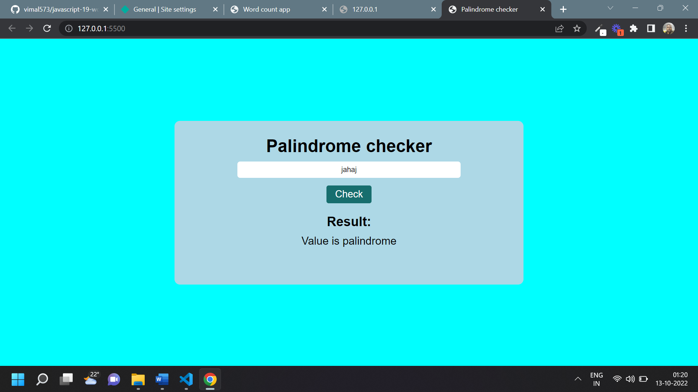

# Javascript Assignment Palindrome checker

## Palindrome Checker [Live Link](https://name-conversion-js.netlify.app/)

- Skills Gained in this project

  - convert string through destructuring into array

  - reverse that array and join after that compare to original string

---

## Time taken to finish this project

- 1 hr to complete it

#### Screenshot

